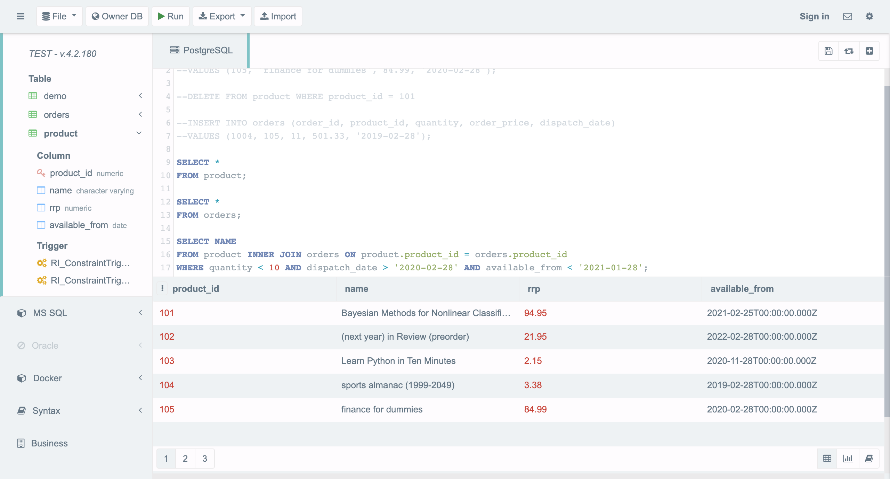

# Step by step

1. Went to [https://sqliteonline.com/](https://sqliteonline.com/) to create a dummy database for querying
2. Created the tables from the examples

```jsx
create table product
(
product_id number primary key,
name varchar2(128 byte) not null,
rrp number not null,
available_from date not null
);
create table orders
(
order_id number primary key,
product_id number not null,
quantity number not null,
order_price number not null,
dispatch_date date not null,
foreign key (product_id) references product(product_id)
);
```

 

Product Table



Order Table


Result from Query (Learning Python in Ten Minutes)

```sql
SELECT name
FROM product INNER JOIN orders on product.product_id = orders.product_id
WHERE quantity < 10 AND dispatch_date > '2020-02-28' AND available_from < '2021-01-28';
```

